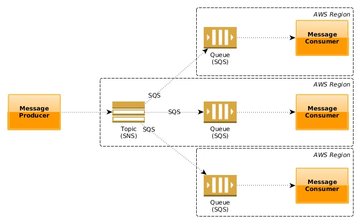
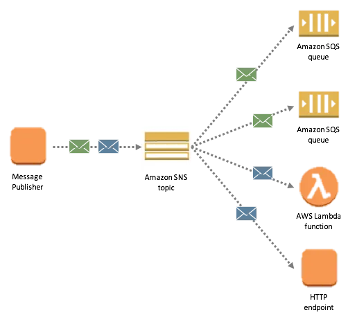

AWS SQS and SNS are both messaging services provided by Amazon Web Services (AWS), but they serve different purposes:

**AWS SQS (Simple Queue Service):**

- SQS is a fully managed message queuing service that allows decoupling of components in a distributed application.
- It enables applications to send, store, and receive messages between different software components, helping to ensure reliable message delivery.
- SQS follows the "pull" model, where consumers request messages from the queue.
- **Use Cases:** SQS is commonly used for tasks where asynchronous communication is required, such as decoupling application components, handling background jobs, and managing work queues.

**AWS SNS (Simple Notification Service):**

- SNS is a fully managed publish/subscribe messaging service.
- It allows applications to send messages to multiple recipients, known as subscribers, simultaneously.
- SNS follows the "push" model, where messages are pushed to subscribers based on their preferences.
- **Use Cases:** SNS is commonly used for broadcasting messages to multiple recipients, such as sending notifications, alerts, and event notifications to multiple endpoints (e.g., email, SMS, HTTP endpoints).

**Using SQS and SNS in a "Fanout" Pattern:**
A "fanout" pattern involves broadcasting a message from a single source to multiple destinations. In AWS, you can achieve this using SNS and SQS together.
1. The message producer sends a message to an SNS topic.
2. The SNS topic is configured to deliver messages to multiple SQS queues (subscribers) that are interested in receiving the message.
3. Each SQS queue processes the message independently.
This pattern allows you to decouple message producers from consumers, and each consumer (SQS queue) can process the message at its own pace.

**Push Notifications with SNS:**
Push notifications involve sending real-time messages to mobile devices or other endpoints like web browsers. Here's how it works using AWS SNS:
1. Mobile devices or endpoints subscribe to an SNS topic.
2. When an event of interest occurs, the application or server publishes a message to the SNS topic.
3. SNS delivers the message to all subscribed endpoints simultaneously.
4. Mobile devices receive the push notification, and other endpoints process the message accordingly.

**Large Scale Distributed Application and SQS:**
In a large-scale distributed application, using an SQS queue can help manage workload efficiently and handle potential bursts of traffic. The application's components can send messages to the SQS queue, and multiple worker instances can retrieve and process these messages concurrently. This decoupling ensures that the processing of messages can scale independently from message production.
For example, if the application experiences a surge in traffic, the messages will be stored in the SQS queue, and the worker instances can process them as quickly as possible without overwhelming the application's components. Additionally, SQS provides durability, ensuring that no messages are lost, and guarantees at-least-once delivery, making it a reliable component for distributed systems.

---