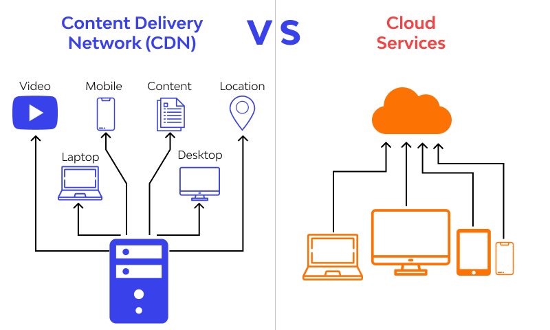

# Amazon S3:

**1. What is Amazon S3?**
Amazon S3 (Simple Storage Service) is a cloud-based object storage service provided by Amazon Web Services (AWS). It is designed to store and retrieve any amount of data over the internet securely and efficiently. S3 allows users to store and manage data, such as images, videos, documents, backups, and application data, making it a scalable and cost-effective solution for data storage.

**2. Name some use cases for Amazon S3:**
- Data Backup and Archiving: Storing backups of critical data and archiving older data for compliance or regulatory requirements.
- Website Hosting: Storing static website content like HTML, CSS, images, and videos to be served to visitors.
- Content Distribution: Distributing large files or media to a global audience with reduced latency and faster download times.
- Big Data Analytics: Storing and analyzing large datasets used in data analytics and machine learning applications.
- Application Data Storage: Storing and accessing application data used by various services or applications.

**3. Name some benefits of using Amazon S3:**
- Scalability: S3 can handle virtually unlimited data storage, allowing users to scale their storage needs as their data grows.
- Durability and Reliability: Data stored in S3 is replicated across multiple servers and data centers, ensuring high durability and availability.
- Security: S3 offers access control mechanisms, encryption, and integration with AWS Identity and Access Management (IAM) for secure data management.
- Cost-Effective: Users only pay for the storage they consume, and S3 offers various storage classes to optimize costs based on data access frequency.
- Easy Integration: S3 integrates seamlessly with other AWS services, making it easier to build complex cloud-based applications.

# AWS Lambda:

**1. What is AWS Lambda?**
AWS Lambda is a serverless computing service provided by AWS. It allows developers to run code without provisioning or managing servers. Lambda executes code in response to events from other AWS services, HTTP requests, or custom triggers. The service automatically scales the execution environment and charges users only for the compute time consumed during code execution.

**2. Name some use cases for AWS Lambdas:**
- **Real-Time Data Processing**: Lambdas can process real-time streaming data from services like Amazon Kinesis and trigger actions based on the data.
- **Automated Backups and Maintenance**: Lambdas can automate the process of creating backups, updating configurations, or performing routine maintenance tasks.
- **Image and Video Processing**: Lambdas can be used to resize images, transcode videos, or apply various filters on media files.
- **Webhooks and API Integration**: Lambdas can handle incoming HTTP requests and integrate with external APIs.
- **Chatbots and Serverless Applications**: Building serverless applications, including chatbots and microservices, using Lambda functions.

**3. Describe "serverless" to a non-technical friend:**
"Serverless" in the context of cloud computing does not mean that there are no servers involved. Instead, it means that, as a developer, you don't have to worry about managing those servers. Imagine you have a magic service that automatically takes care of running your code whenever something specific happens, like receiving a message or someone uploading a file. You only need to write the code you want to run, and this magic service will handle everything else, like setting up servers, running the code, and shutting them down when done. It's like having a personal assistant for your code!

# CDN (Content Delivery Network):

**1. What is a CDN?**
A Content Delivery Network (CDN) is a geographically distributed network of servers that work together to deliver web content, such as images, videos, scripts, and stylesheets, to users more efficiently. The primary goal of a CDN is to reduce the latency and improve the performance of a website by caching and delivering content from servers located closer to the website visitors.

**2. How does a CDN work with relation to the website visitor?**
When a user visits a website that utilizes a CDN, the CDN automatically determines the closest server to the user based on their geographical location. The CDN server closest to the user will then retrieve and deliver the requested content. By doing this, the CDN reduces the round-trip time (latency) for content delivery, resulting in faster load times and a better user experience.

**3. What are the benefits of employing a CDN?**
- **Improved Website Performance**: CDNs reduce the load time of web pages by serving content from servers near the user, reducing latency and speeding up content delivery.
- **Scalability**: CDNs can handle large amounts of traffic and distribute it across multiple servers, ensuring the website remains available and responsive even during traffic spikes.
- **Reduced Bandwidth Costs**: CDNs optimize data delivery, reducing the amount of data transmitted between the website's origin server and the end user, potentially lowering bandwidth costs.
- **Enhanced Global Reach**: CDNs have servers located in multiple regions worldwide, allowing websites to reach a global audience with minimized delays in content delivery.
- **Improved Reliability**: In case of server failures or high demand, CDNs can automatically reroute requests to other healthy servers, improving overall reliability.