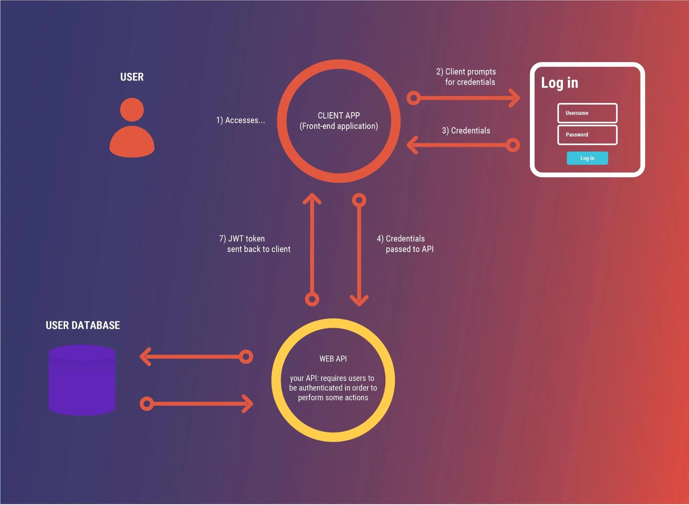

# Bearer Authorization

## Intro to JWT

A **JSON Web Token (JWT)** is a compact and self-contained mechanism for securely transmitting information between parties as a JSON object. It consists of three parts: `a header, a payload, and a signature.`

The **header of a JWT** contains information about the algorithm used to generate the signature and the type of the token. It is encoded using `Base64Url` encoding.

The **payload**, also known as the **claims**, contains the actual data that needs to be transmitted. *Claims* are statements about an entity (typically the user) and additional metadata. There are three types of *claims*: `registered claims, public claims, and private claims`. *Registered claims* are predefined and *standardized claims* like "iss" (issuer), "exp" (expiration time), and "sub" (subject). *Public claims* are custom claims that can be defined by the user, but should be registered in a public registry to avoid conflicts. *Private claims* are custom claims that are specific to a particular application and should be agreed upon between parties beforehand.

The **signature** is used to verify the integrity of the token and ensure that it has not been tampered with. `It is generated by combining the encoded header, encoded payload, a secret key (or public/private key pair), and applying a specific algorithm specified in the header`. The signature is also encoded using `Base64Url` encoding.

**JSON Web Tokens are commonly used in authentication and authorization scenarios.** They can be used to authenticate users and securely transmit information about the user, such as their identity, roles, and permissions. JWTs are often used in stateless, token-based authentication systems, where the server can validate the token without the need for storing session information.

JWTs are particularly useful in distributed systems and APIs, as they can be easily transmitted as HTTP headers or URL parameters. They provide a way to securely transmit information between different services or components without the need for constantly checking with a central authority.

In summary, *JWTs* are used when there is a need for secure and compact transmission of information between parties, particularly in authentication and authorization scenarios. *Claims*, which contain the actual data, are expected in the payload component of a JWT.

---

## Are JWTs Secure?

JWTs provide a level of security, but their security *depends on how they are implemented and used.*

**If you can decode the payload of a JWT, how can we call that secure?**

The security of JWTs does not rely on the secrecy of the payload. The payload, which contains the claims, is base64-encoded and easily decoded. However, the security of JWTs comes from the signature. The signature is created using a secret key that is only known to the server or the issuer of the token. When the receiver receives a JWT, it can verify the signature using the same secret key. If the signature is valid, it ensures that the token has not been tampered with. Therefore, the security lies in the integrity of the token, rather than the secrecy of its contents.

**When sending a JWT, what must the sender and receiver both know?**

The sender and receiver must both know the secret key used to generate and verify the signature of the JWT. The secret key is appended in the signature part of the JWT. The sender signs the JWT with the secret key, and the receiver uses the same secret key to verify the signature. This shared secret key ensures that only parties with access to the key can generate and validate JWTs.
