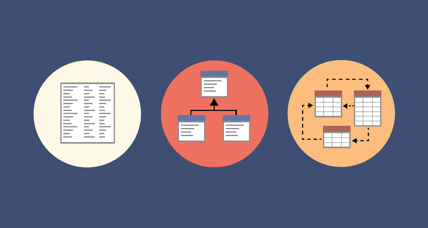

**When considering the best fit for a complex query-intensive environment**:

`SQL databases are often a good choice`.

SQL databases, also known as relational databases, are designed to handle *complex queries efficiently*. They have a well-defined schema and support powerful querying capabilities through the SQL language. SQL databases excel at handling structured data and ensuring data integrity through relationships between tables. They are widely used in applications where complex querying and data consistency are essential, **such as:**

1. financial systems.
2. e-commerce platforms.
3. enterprise applications.

**On the other hand, when dealing with hierarchical data storage:**

 `NoSQL databases are often a better fit`.

 NoSQL databases, which stand for "not only SQL," are designed to *handle unstructured and semi-structured data, including hierarchical data*. They offer flexible schemas that allow for dynamic and evolving data structures. **NoSQL databases come in various types, including:**

 1. document databases.
 2. key-value stores.
 3. columnar databases.
 4. graph databases.

Among these types, graph databases specifically excel in representing and traversing hierarchical data structures, making them a suitable choice when dealing with relationships and complex hierarchies, **such as:**

1. social networks.
2. recommendation engines.
3. knowledge graphs.

**Now, let's discuss scalability differences between SQL and NoSQL databases in a non-technical manner:**

Imagine you have a bookstore, and your business starts growing rapidly. You need a system that can handle more customers and a larger inventory seamlessly. In this case, scalability becomes crucial.

* *SQL databases are like traditional libraries with a librarian managing all the books. As more people come to borrow books, the librarian might struggle to keep up with the demand. To accommodate more people, you might need to hire additional librarians and expand the library infrastructure.* **SQL databases follow a similar pattern. They have a fixed structure and need careful planning to scale. You may need to invest in more powerful servers or distribute the data across multiple servers, which can be complex and costly.**

* *On the other hand, NoSQL databases are like having multiple librarians, each responsible for a specific genre of books. As more people come, you can add more librarians to handle the workload.* **NoSQL databases are designed to scale horizontally by adding more servers to the system. This approach allows them to handle increased traffic and data without significantly affecting performance. Scaling a NoSQL database is relatively straightforward and can be done by adding more servers as needed.**

***In summary:***

* SQL databases are a great fit for complex query-intensive environments.

* while NoSQL databases excel at handling hierarchical data storage.

    **When it comes to scalability:**

* SQL databases require careful planning and infrastructure upgrades
  
* NoSQL databases are designed to scale easily by adding more servers to the system.

# sql modeling techniques

A **one-to-many relationship in database modeling** refers to a relationship between two tables where `one record in the first table can be associated with multiple records in the second table,` **`but each record in the second table can only be associated with one record in the first table.`**

To "relate" the tables in a one-to-many relationship:

 we use keys. Specifically, we use the **primary key of the "one" table as a reference in the "many" table.** The primary key *uniquely identifies* each record in the "one" table. In the "many" table, we include a **foreign key column that holds the reference to the primary key of the associated record in the "one" table.** This establishes the relationship between the two tables.

Before designing a relational database, it is helpful to create a **schema** of the database tables and their relationships. A database schema is a *visual representation or diagram that shows the structure of the database, including the tables, columns, and relationships between the tables.* It helps in understanding the organization of the data and the connections between different entities.

**Now, let's explain the difference between a primary key and a foreign key:**

* A primary key is a unique identifier for each record in a table. It uniquely identifies each individual record within the table and ensures data integrity. A primary key column must have a unique value for each record, and it cannot contain duplicate or null values. Typically, primary keys are automatically generated using a sequence or identity mechanism or assigned by the database system.

* On the other hand, a foreign key is a column or a set of columns in a table that establishes a link to the primary key of another table. It represents a relationship between two tables. The foreign key in one table references the primary key in another table, creating a connection between them. The purpose of the foreign key is to enforce referential integrity, ensuring that the values in the foreign key column match the values in the referenced primary key column or are null. This constraint ensures that the relationship between the tables is maintained and prevents orphaned records.

**In summary:**

* the primary key uniquely identifies records within a table.

* while the foreign key establishes a relationship between two tables by referencing the primary key of another table.

* The primary key ensures the uniqueness and integrity of the data within a table.

* while the foreign key maintains the integrity and enforce the relationship between tables.

**In SQL syntax, keywords and parameters are treated differently.**

**Keywords** are *reserved words* that have a specific meaning in SQL. They are part of the SQL language and cannot be used as identifiers for tables, columns, or other database objects. Examples of SQL keywords include `SELECT, INSERT, UPDATE, DELETE, WHERE, JOIN, and ORDER BY.` Keywords are used to define the structure of SQL statements and specify the operations to be performed on the database.

**Parameters,** on the other hand, *are values that are provided as inputs to SQL statements.* They are placeholders that are used to pass dynamic values into the SQL query or command. Parameters allow for more flexibility and security in SQL statements, as they can be used to handle user input or variable data. Parameters are typically represented using placeholders, such as `question marks (?) or named parameters (:param_name),` and their actual values are provided when executing the SQL statement.

**Normalization,** within the context of schemas and data, *is a process of organizing the data in a database to minimize redundancy, ensure data integrity, and improve data consistency.* It involves breaking down a database into smaller, well-structured tables that represent unique entities and relationships. Normalization `aims to eliminate data duplication and dependencies, reducing the chances of data inconsistencies and anomalies.`

In terms of relationships, let's explain them in a non-technical manner:

* **One-to-One Relationship:** Imagine you have a company's employee records. In a one-to-one relationship, each employee has only one corresponding employee ID badge, and each employee ID badge belongs to only one employee. It's like each employee having a unique ID badge assigned to them, and there are no duplicate or shared badges. `This type of relationship is typically used when two entities have a direct and exclusive connection.`

* **One-to-Many Relationship:** Let's consider a scenario with a company's departments and employees. In a one-to-many relationship, a department can have multiple employees, but each employee belongs to only one department. It's similar to a department being like a parent and the employees being the children. One department can have many employees, but each employee is associated with only one department. `This type of relationship is common when there is a hierarchical structure or when multiple records in one table relate to a single record in another table.`

* **Many-to-Many Relationship:** Now, imagine a situation with students and courses. In a many-to-many relationship, multiple students can enroll in multiple courses, and each course can have multiple students. It's like students can take multiple courses, and each course can have many students enrolled. To represent this relationship, an intermediary table, called a junction table or associative table, is used. This table acts as a bridge between the student and course tables, storing the combinations of student IDs and course IDs. `Many-to-many relationships are common when there is a need to represent complex relationships where multiple entities are connected with each other.`

In summary:

* **one-to-one relationship** is like having a unique match or pair.

* **one-to-many relationship** is like a parent with multiple children,  

* **many-to-many relationship** is like a many-to-many connection where multiple entities are linked together.
