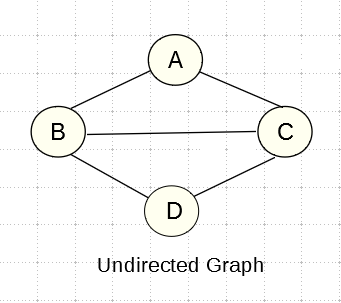
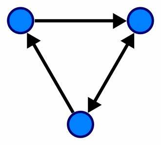
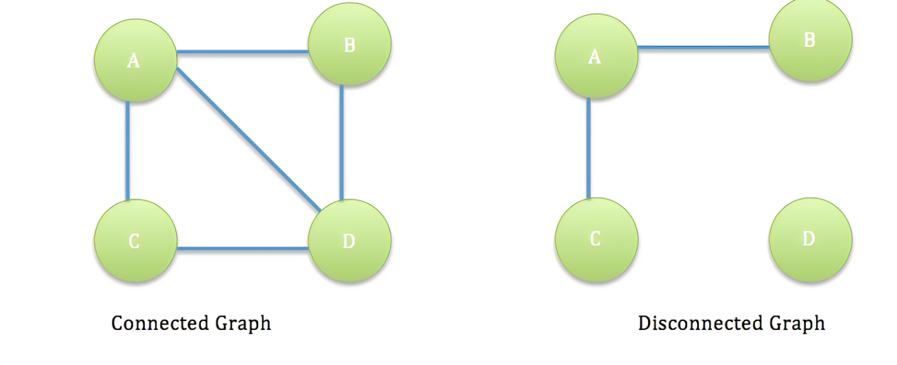
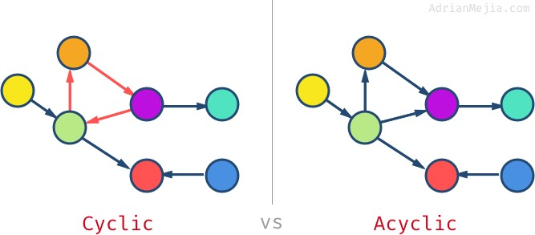

# Graph : 

*A graph is a non-linear data structure consisting of vertices (nodes) connected by edges. Common graph terminology includes vertices, edges, neighbors, and degree. Graphs can be categorized as undirected (edges have no direction) or directed (edges have direction).*

## Undirected Graphs: 

In undirected graphs, edges are bi-directional, and there are no specific directions. They can be represented by a set of vertices and a set of undirected edges.

## Directed Graphs (Digraphs): 

Directed graphs have edges with specific directions. Each node is directed at another node. Directed graphs can be represented by vertices and directed edges.

## Complete vs. Connected vs. Disconnected Graphs:

1. Complete Graphs: 
    * All nodes are connected to all other nodes.

2. Connected Graphs: 
    * All vertices have at least one edge.

3. Disconnected Graphs: 
    * Some vertices may not have edges.

## Acyclic vs. Cyclic Graphs:

1. Acyclic Graphs: 
    * No cycles (a path that starts and ends at the same vertex).

2. Cyclic Graphs: 
    * Contain cycles.

## Graph Representation:

1. Adjacency Matrix: 
    * A 2D Boolean matrix representing connections between vertices. Rows and columns correspond to vertices, and matrix values indicate edges.

2. Adjacency List: 
    * A collection of linked lists or arrays, where each node's list contains its adjacent vertices.

3. Weighted Graphs: 
    * Graphs with numbers assigned to edges (weights). Weights can be represented using adjacency matrices or lists, including both the weight and adjacent vertices.

## Traversals:

1. Breadth-First Traversal: 
    * Starts at a specified node and visits nodes level by level, adding unvisited neighbors to a queue.

2. Depth-First Traversal: 
    * Utilizes a stack to explore as far as possible along each branch before backtracking.

## Real-World Uses of Graphs:
    * Graphs have various real-world applications, including GPS and mapping, driving directions, social networks, airline traffic routing, and recommendation systems like Netflix.

    * Graphs are a versatile data structure used to model and solve various complex problems, making them an essential concept in computer science and data analysis.